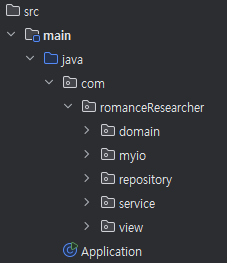
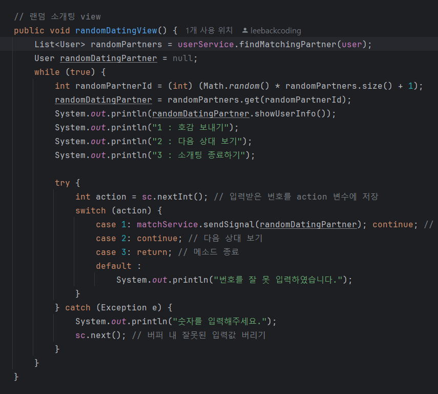
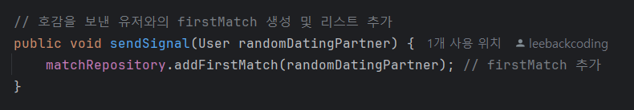
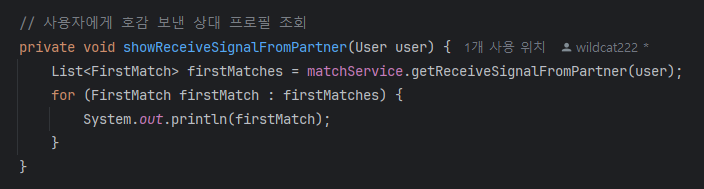

# ❄️만년설 (FallingInLove)
### Slogan : 설렘 가득한 만남, 시작하세요.
만남..👋 연애..❤️ 설렘..🥰 우리의 **"만년설"** 로 올래?
 

----

 

### 팀명 : **2R** (Romance Researchers)
### 팀원 : 김태영 | 이창윤

 

## 프로젝트 소개

만년설은 랜덤으로 소개팅 상대의 프로필을 제공하여 이상형에 가까운 이성에게 호감을 표하고 서로의 동의 하에 소개팅을 주선해주는 소개팅 주선 플랫폼입니다.

 

## 🧑‍🤝‍🧑사용자 기능
- 회원가입, 회원 정보 수정, 회원 탈퇴
- 로그인, 로그아웃
- 내 정보 조회

## 💕랜덤 소개팅 기능
- 필터링 된 소개팅 상대 프로필을 랜덤으로 제공
- 호감 주고 받기
- 서로 호감을 주고 받을 시 소개팅 매칭

 
 

## 🖥️프로젝트 주요 코드
### 구조

 
 

### 사용자와 상대 사용자의 동의 하에 소개팅 주선

- 사용자에게 랜덤으로 소개팅 상대의 프로필을 제공합니다.

 

- 호감을 주고 받을 수 있습니다.

 

- 상대 사용자도 호감을 보낼 경우 소개팅이 주선됩니다.

 

### 사용자의 호감 현황 조회

- 사용자가 호감을 보낸 상대 사용자의 목록을 조회할 수 있습니다.

 

- 사용자에게 호감을 보낸 상대 사용자의 목록을 조회할 수 있습니다.

 

